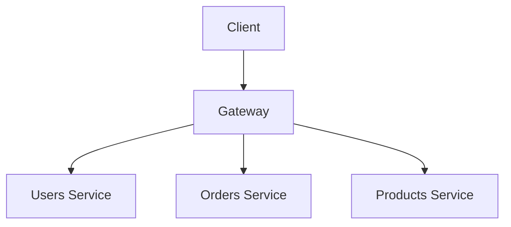

import { Tabs } from 'nextra/components'

# GraphQL Federation

In today's world of distributed systems and microservices,
organizations face the challenge of efficiently managing and scaling their APIs.
As applications grow more complex, traditional monolithic approaches often fall short.
This is where federation comes into play - an architectural pattern that has found particular resonance in the GraphQL ecosystem.

GraphQL Federation gained widespread adoption after [Apollo GraphQL introduced Apollo Federation in 2019](https://www.apollographql.com/blog/apollo-federation-f260cf525d21).
Their implementation has become a reference point for the GraphQL community,
helping establish federation as a standard architectural pattern in the GraphQL ecosystem.

The GraphQL ecosystem is moving towards standardization of federation patterns.
The GraphQL Foundation's [Composite Schema Working Group](https://github.com/graphql/composite-schemas-wg),
which includes engineers from various organizations across the industry including
Apollo GraphQL, ChilliCream, Google, Graphile, The Guild, Hasura, and IBM,
is actively working on creating an official specification for GraphQL Federation.
This effort aims to standardize how GraphQL services can be composed and executed across distributed systems,
while ensuring room for innovation and different implementations.

## What is federation?

Federation is an approach to organizing and managing distributed systems.
At its core, federation allows autonomous components to work together while maintaining their independence.
Think of it like a federal government system: individual states maintain their sovereignty
while cooperating under a central authority for shared concerns.

In software architecture, federation enables organizations to:

- Distribute responsibility across independent teams
- Scale different components independently
- Maintain clear boundaries between different domains
- Enable autonomous development and deployment
- Reduce single points of failure

Think of the "Login with Google" or "Login with Facebook" buttons you see on websites.
This is federation in action: you can use your Google or Facebook account to log into many different websites,
even though each company manages their own login system separately.

## What Is Federated GraphQL?

GraphQL Federation applies those principles to GraphQL APIs.
It enables organizations to build a unified GraphQL schema from multiple independent services (most often called subgraphs),
each responsible for its portion of the application's data graph.

Consider an e-commerce platform: You might have separate teams managing products, user accounts, and order processing. With GraphQL Federation, each team can:

- Define their own GraphQL schema
- Deploy and scale their service independently
- Contribute to a unified API without tight coupling
- Maintain ownership of their domain-specific logic

The magic happens through a federated gateway that acts as the central coordinator, combining these separate schemas into a unified schema that clients can query.

## How Federation Works in GraphQL

The federation process involves several key components:

- **Subgraphs**: Individual services that define their own GraphQL schemas and resolvers
- **Gateway**: A specialized service that sits between clients and your federated services
- **Schema composition**: The process of merging schemas while resolving references between them, often handled by schema registries.

<Tabs items={['Products subgraph', 'Orders subgraph', 'Users subgraph']}>
<Tabs.Tab>

```graphql
type Product @key(fields: "id") {
  id: ID!
  title: String!
  price: Float!
  inStock: Boolean!
}
```

</Tabs.Tab>
<Tabs.Tab>

```graphql
type Order @key(fields: "id") {
  id: ID!
  products: [Product!]!
  total: Float!
}

type Product {
  id: ID!
}
```

</Tabs.Tab>
<Tabs.Tab>
```graphql
type Query {
  user(id: ID!): User
}

type User {
  id: ID!
  name: String!
  email: String
  orders: [Order!]!
}

type Order {
  id: ID!
}
```

</Tabs.Tab>
</Tabs>

### Schema Composition

Let's break down schema composition in GraphQL federation with more detail and examples.
Schema composition is the process where multiple subgraph schemas are combined into one unified schema.
It's more complex than simply merging schemas together, because it needs to handle relationships, detect incompatibilities, and ensure types are properly connected across services.

Based on the examples we provided before, here's the unified schema GraphQL clients will see and can query:

```graphql
type Query {
  user(id: ID!): User
}

type User {
  id: ID!
  name: String!
  email: String
  orders: [Order!]!
}

type Order {
  id: ID!
  products: [Product!]!
  total: Float!
}

type Product {
  id: ID!
  title: String!
  price: Float!
  inStock: Boolean!
}
```

This unified schema combines types and fields from all three subgraphs (Users, Orders, and Products), allowing clients to seamlessly query across these domains.

### Gateway

The federation gateway is the entry point to your distributed data graph.
It presents a unified GraphQL endpoint to clients
and handles the complexity of routing queries to the appropriate subgraphs and assembling the results,
often provides caching and performance optimizations.



Take the following query as an example:

```graphql
query {
  user(id: "123") {
    # Resolved by Users subgraph
    name
    orders {
      # Resolved by Orders subgraph
      id
      products {
        # Resolved by Products subgraph
        title
        price
      }
    }
  }
}
```

The gateway will route parts of the query to the appropriate subgraphs, collect the results,
and assemble them into a single response that the client can consume.

## Benefits of GraphQL Federation

### Domain-Driven Development

Teams can work independently on their services while contributing to a cohesive API.
This autonomy accelerates development and reduces coordination overhead.

### Service Integrity Protection

The schema composition step verifies integration between services
by ensuring that changes in individual subgraphs
do not conflict with other subgraphs in the federation.

### Scalability and Performance

Services can be scaled independently based on their specific requirements.
The product catalog might need different scaling characteristics than the order processing system.

### Single, Unified API

Thanks to GraphQL gateway, clients get a single endpoint with unified schema.
The complexity of distributed systems is hidden.
The gateway ensures every query reaches its destination and returns with the right data.

## Federation vs. Monolithic Architecture

While monolithic GraphQL APIs have their place, federation offers several advantages for larger applications:

| **Aspect**        | **Monolithic GraphQL**            | **Federated GraphQL**         |
| ----------------- | --------------------------------- | ----------------------------- |
| Development Speed | Initially faster                  | Better for long-term velocity |
| Team Coordination | Requires significant coordination | Enables independence          |
| Deployment        | All-or-nothing                    | Independent deployments       |
| Scaling           | Entire system scales together     | Independent scaling           |

## Real-World Implementations

GraphQL Federation is adopted by tech giants such as
[Netlifx](https://netflixtechblog.com/how-netflix-scales-its-api-with-graphql-federation-part-1-ae3557c187e2),
[Expedia Group](https://youtu.be/kpeVT7J6Bsw?si=srGWsoxf3kTmneTu&t=79),
[Volvo](https://www.apollographql.com/blog/volvo-cars-drives-into-the-future-of-online-car-shopping-with-the-supergraph),
and [Booking](https://youtu.be/2KsP_x50tGk?si=mu-MOG-xZQSDNDjh&t=478).

Many industry leaders successfully use GraphQL federation at scale, proving that federation works reliably for large-scale production applications.

## Getting Started with GraphQL Federation

To implement GraphQL federation, organizations should:

1. **Identify Service Boundaries**: Define clear boundaries between different domains in your application
2. **Design Schemas**: Create schemas that reflect these boundaries while considering how they'll interact
3. **Implement Subgraphs**: Build individual services that implement their portion of the schema
4. **Set Up Gateway**: Deploy a federation gateway to compose and serve the unified schema
5. **Monitor and Optimize**: Implement monitoring and continuously optimize query performance

Organizations can gradually migrate from a monolithic to federated GraphQL, one service at a time.
